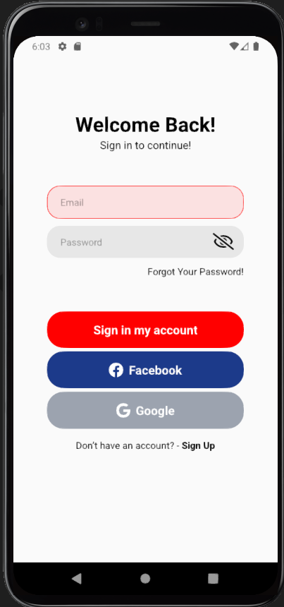
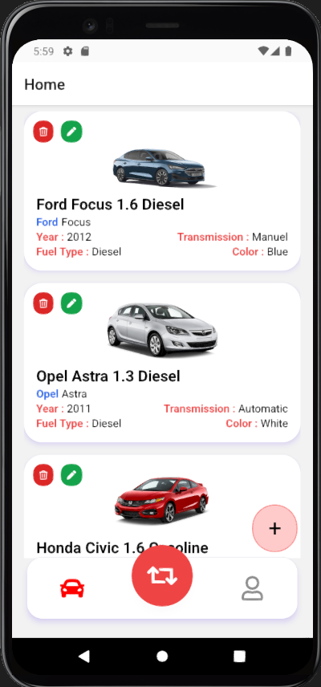
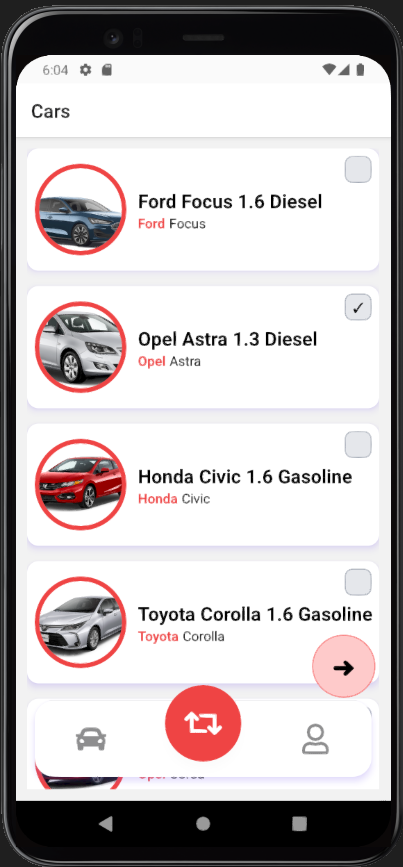
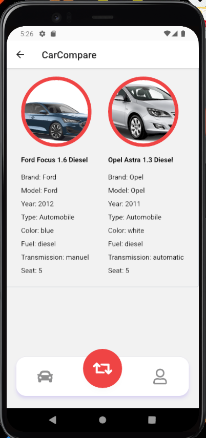
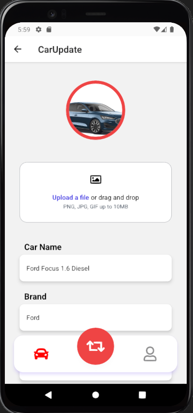
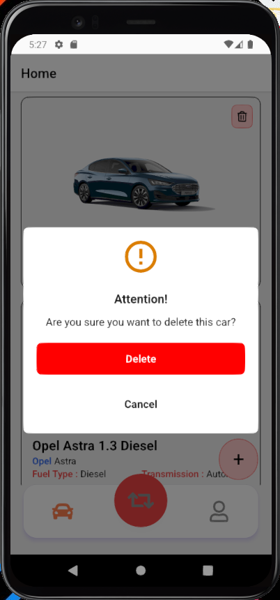
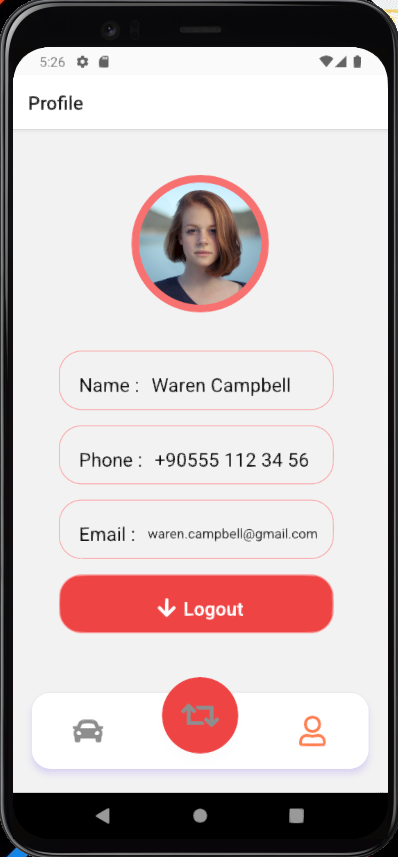

# Araba Karşılaştırma Uygulaması

Bu proje, kullanıcının arabaları karşılaştırmasına olanak tanıyan basit bir mobil uygulamadır. Kullanıcılar, Facebook veya Google hesaplarıyla giriş yapabilir ve ardından bir araba listesi görüntüleyebilir. Listede yer alan arabaları silebilir, güncelleyebilir veya yeni araba ekleyebilirler. Ayrıca, kullanıcılar iki araba seçip devam et butonuna bastıklarında, seçilen arabaların özelliklerini karşılaştıran bir ekranla yönlendirilirler. Son olarak, kullanıcıların profil bilgileri, giriş yöntemlerinden alınan verilerle üçüncü bir ekranda görüntülenir. Uygulama, Firebase ile bağlantı kurarak kullanıcı kimlik doğrulaması ve veritabanı işlemlerini gerçekleştirir.

## Kullanılan Teknolojiler

- React Native

- Expo

- Firebase (firebase/auth)

- Tailwind CSS

## Kurulum

**1. Projeyi klonlayın:**

     git clone https://github.com/yasin03/carCompare-RN.git

**2. Proje klasörüne gidin,**

**3. Gerekli paketleri yükleyin:**

     npm install or yarn add

**4. Expo CLI ile projeyi başlatın:**

     expo start or yarn start

**5. Uygulamayı bir simülatörde çalıştırın veya fiziksel bir cihazda Expo Client uygulamasını kullanarak tarayın.**

## Kullanım

1. Uygulamayı başlatın ve giriş ekranına yönlendirilin.

2. Facebook veya Google seçeneklerinden biriyle giriş yapın.

3. Ana sayfaya yönlendirildiğinizde, alt gezinme çubuğunda üç sekme göreceksiniz.

4. İlk sekmede arabaların listesini görüntüleyin. Liste yüklenirken skeleton placeholder görüntülenir.

5. Listeden bir araba seçin ve silme, güncelleme veya yeni araba ekleme işlemlerini gerçekleştirin.

6. İkinci sekmede iki araba seçin ve devam et butonuna tıklayın. Karşılaştırma ekranına yönlendirileceksiniz.

7. Karşılaştırma ekranında seçtiğiniz arabaların özelliklerini iki sütun halinde görüntüleyin.

8. Üçüncü sekmede profil bilgilerinizi görüntüleyin, fotoğraf, e-posta vb.

9. Çıkış yapmak için çıkış yap butonuna tıklayın.

## Uygulama Resimleri

## Lisans

Bu proje MIT lisansı altında lisanslanmıştır. Detaylar için [Lisans Dosyası](LICENCE)
